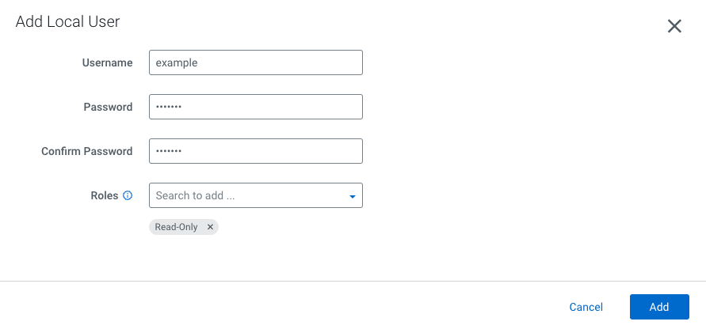

# Project Heartbeat for Airgapped Customers
v2.0

# New Additions
Data Services & ECS Support, Optional hardware SKU/versioning


# Automation for Obtaining Cluster Metadata
1. Cluster Name
2. Cluster Type (Exp, Base, Compute)
3. Full Cluster unique identifier
4. Cloudera Manager Full Version
5. Cloudera Runtime Full Version 
6. List of Parcels on Cluster
7. UUID portion of the license
8. (Optional) Hardware distro, version, type
9. Total nodes under management in each cluster
10. Total Number of logical cores in each cluster
11. Total Size of memory in each cluster
12. Total allocated storage for HDFS in each cluster
13. Total allocated storage for Ozone in each cluster
14. Date/Time of report creation


# Installation / Run (from Linux host)
1. Referencing your local python installation, and from the folder you wish to create the output document in, enter the command ```python -m venv venv``` (or `python3` depending on how your python distro is aliased). This command creates a virtual environment for you to ```pip``` install the necessary packages from PyPi from. Note that if you get some kind of error on this step, it is likely because the python3 environment variable is not set, in which case you will have to use the fully qualified path of your python installation before the remainder of the command.
2. Run ```source venv/bin/activate``` to start the virtual environment.
3. Run ```pip install -r requirements.txt``` to install the necessary artifacts from PyPi to run the script (total size is ~35mbs).
4. Use ```vim``` or another similar command line editor to ensure the ```heartbeat_airgapped.conf``` file has the proper configuration to run the script.
5. Execute the python script by running ```python heartbeat_airgapped_v2.py``` from within the virtual environment.
6. Copy the created file(s) wherever needed via ```scp```, ```cp```, or a similar command and type ```deactivate``` to close the virtual environment.


# Installation / Run (from personal machine)
Because of the nature of airgapped hosts, it may be that you are not able to connect to PyPi, or have access to the modules needed to run this script from a server. In the case that your organization does not have an internal image of PyPi (JFrog Artifactory, etc.) that you can reference from behind a proxy, run the code from your personal machine following the steps below:

1. Referencing the local python distribution on your PC or Mac (if you dont have one you will need to install one), navigate to the folder you want to create your output document in and enter the command ```python -m venv venv```. This command creates a virtual environment for you to ```pip``` install the necessary packages from PyPi from. Note that if you get some kind of error on this step, it is likely because the python3 environment variable is not set, in which case you will have to use the fully qualified path of your python installation before the remainder of the command.
2. Run ```source venv/bin/activate``` to start the virtual environment.
3. Run ```pip install -r requirements.txt``` to install the necessary artifacts from PyPi to run the script (total size is ~35mbs).
4. Use ```vim``` or another similar command line editor to ensure the ```heartbeat_airgapped.conf``` file has the proper configuration to run the script.
5. Execute the python script by running ```python heartbeat_airgapped_v2.py``` from within the virtual environment.
6. Copy the created file(s) wherever needed via your local file browser and type ```deactivate``` to close the virtual environment.

The ```offline_pip_dependencies``` folder is provided for totally airgapped customers to leverage if they do not have access to pip altogether. It contains the wheels and tars that a pip install pulling from PyPi or proxy of PyPi would provide.

Note that if the above still doesn't work, you can create the virtual environment on an internet-connected PC and copy the files to the host with a connection to the CM server after; however, you will have to symlink the python distro to your current python version on that host for the virtual environment to work there. 


# Definitions
Running this script is subject to proper configuration / variable assignment in ```heartbeat_airgapped.conf```. It also presupposes proper folder ownership for the directory that the python script is executing from. This script was specifically designed for the most minimal set of permissions necessary, hence, **READ ONLY** permission is sufficient for the CM user you provide in ```heartbeat_airgapped.conf``` to run the script.

1. `heartbeat_airgapped_v2.py` - Runtime/Script
2. `heartbeat_airgapped.conf` - Configuration file
3. `requirements.txt` - Pip requirements file
4. `Basic Cluster (Kerberos)_2023-08-28 13:28:22.275554` - Sample output csv
5. `/offline_pip_dependencies` - Wheels and tars for offline pip install of dependencies
6. `/archive` - Archived/older versions



# License and Copyright
Copyright 2023, Cloudera, Inc.

Licensed under the Apache License, Version 2.0 (the "License");
you may not use this file except in compliance with the License.
You may obtain a copy of the License at

    http://www.apache.org/licenses/LICENSE-2.0

Unless required by applicable law or agreed to in writing, software
distributed under the License is distributed on an "AS IS" BASIS,
WITHOUT WARRANTIES OR CONDITIONS OF ANY KIND, either express or implied.
See the License for the specific language governing permissions and
limitations under the License.